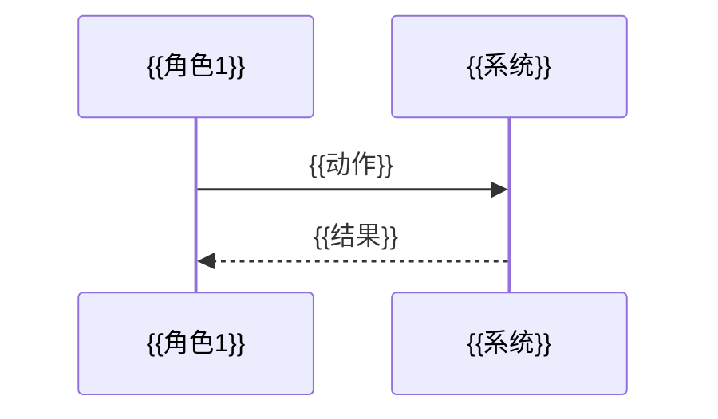

触发：**`/prd`**。

## Agent 必须执行

### 1. 理解需求

- 明确要求用户描述要编写 PRD 的产品/功能/模块（若用户已提供充分说明则可跳过）。
- 确认以下信息：
  - **产品/功能名称**（用于标题和文件名）
  - **适用范围**（哪些端/子项目涉及：引擎/BFF/UI/website/Java后端/Go后端/客户端）
  - **核心要解决的问题**
  - **有没有现有文档/讨论纪要/原型可以参考**
  - **功能的复杂度**（小功能/中等模块/大型产品级）— 决定选取哪些章节

### 2. 检索项目已有 PRD 作为参考

搜索 `docs/products/` 下的 PRD 文档，阅读范例了解项目 PRD 风格。

### 3. 判断版本路径

根据功能归属自动选择路径：

- **v2 新功能** → `docs/products/v2/`
- **v1 存量功能优化** → `docs/products/v1/`

文件名：`{{功能名称}}-PRD.md`（中文 kebab-case）。

### 4. 判断功能复杂度，选取章节组合

#### 小功能（单端、1-2 个页面、无复杂状态流转）
必选：§1 背景与目标 → §3 范围 → §4 角色 → §9.1 功能清单

#### 中等模块（跨端、3-8 个页面、有核心流程）
必选：§1 背景与目标 → §2 价值与指标 → §3 范围 → §4 角色 → §5 用户画像/场景 → §6 核心流程 → §9 功能清单

#### 大型产品级（跨多端、多模块、复杂状态流转、有商业价值考量）
全部章节参考，按实际需要取舍

---

### 5. PRD 章节结构

```markdown
# {{产品名称}} PRD（v{{版本}}）

| 项 | 内容 |
|----|------|
| 文档版本 | v{{版本}} |
| 状态 | {{草案/待评审/已定稿}} |
| 更新日期 | {{当前日期}} |
| 适用范围 | {{涉及端/子项目}} |
| 关联文档 | {{关联 PRD/技术方案}} |

---

## 1. 背景与目标

### 1.1 背景
为什么做这个功能/产品？当前存在什么问题或机会？（用户反馈、数据表现、市场变化、合规要求等）

### 1.2 目标
- {{量化或可验证的目标 1}}
- {{量化或可验证的目标 2}}

### 1.3 非目标（本期不做/暂缓）
- {{本期明确不做的内容}}

---

## 2. 产品价值与成功指标

### 2.1 产品价值主张
用一句话说清：**给谁、解决什么问题、为什么是你做**。

### 2.2 成功指标（如何衡量）

| 指标 | 当前值 | 目标值 | 数据来源 |
|------|--------|--------|----------|
| {{指标名}} | {{基准}} | {{目标}} | {{埋点/报表/第三方}} |

### 2.3 商业价值 / ROI
- **投入估算**：{{预估研发人日 + 涉及团队}}
- **预期收益**：{{效率提升 / 成本节约等}}
- **ROI 分析**：{{多久回本 / 投入产出比}}

### 2.4 竞品分析 / 行业参考
- **{{竞品1}}**：{{他们的做法}}
- **本产品差异化**：{{我们怎么做、差异在哪}}

---

## 3. 范围与关键约束

### 3.1 In（本期必须做）

| 需求 | 优先级 | 说明 |
|------|--------|------|
| {{功能描述}} | P0 | {{不做不能发版}} |
| {{功能描述}} | P1 | {{重要但可延后到下一期}} |
| {{功能描述}} | P2 | {{锦上添花}} |

> **P0** = 不做不能发版 / **P1** = 重要但可延后到下一期 / **P2** = 锦上添花

### 3.2 Out（本期不做）

### 3.3 前置依赖

| 依赖项 | 类型 | 状态 | 说明 |
|--------|------|------|------|
| {{依赖 1}} | 内部模块 | 进行中 / 已完成 / 未开始 | {{依赖关系说明}} |
| {{依赖 2}} | 外部系统 | {{依赖状态}} | {{依赖关系说明}} |

### 3.4 关键约束（硬约束）
- {{业务规则约束}}
- {{技术约束}}
- {{合规/安全约束}}

---

## 4. 角色与端

### 4.1 角色
- **{{角色1}}**：{{职责描述}}
- **{{角色2}}**：{{职责描述}}

### 4.2 涉及的端

| 端 | 核心能力 |
|----|----------|
| 低代码引擎渲染（website/各 client） | ... |
| BFF / 后端双实现（Java + Go） | ... |

### 4.3 用户用例（MUST）

| 角色 | 用例 | 优先级 |
|------|------|--------|
| **{{角色1}}** | 用例1、用例2、用例3... | P0 / P1 / P2 |

> 用例以用户视角描述"谁"能"做什么"。覆盖该角色在本 PRD 范围内的全部操作。

---

## 5. 用户画像与场景

### 5.1 用户画像（Persona）
- **{{画像名称}}**：{{年龄/职业/技术能力等}}
  - **核心诉求**：{{他最关心什么}}
  - **当前痛点**：{{现在用什么替代方案、不爽在哪}}
  - **使用频率**：{{每天/每周/活动期}}
  - **典型场景**：{{在什么情况下会用}}

### 5.2 关键场景描述
- **场景 1**：{{某角色在什么情境下、想达成什么目标、遇到什么障碍}}

---

## 6. 核心流程（端到端，MUST）

### 6.1 {{流程名称1}}

```mermaid
flowchart TD
  {{节点A}} --> {{节点B}}
  {{节点B}} --> {{判断条件}}
  {{判断条件}} -->|是| {{节点C}}
  {{判断条件}} -->|否| {{节点D}}
```

### 6.2 {{流程名称2 — 时序图}}



> 流程图用于帮助理解逻辑流转，评审和开发阶段都以此为准。复杂流程加文字分步骤说明。

---

## 7. 概念对象（产品层）

- **{{对象1}}**：{{定义}}

### 7.1 对象关系图

```mermaid
flowchart LR
  {{对象1}} --> {{对象2}}
```

---

## 8. 状态机（如需要）

```mermaid
stateDiagram-v2
  [*] --> {{初始态}}
  {{初始态}} --> {{下一个态}}: {{触发条件}}
  {{下一个态}} --> [*]
```

---

## 9. 详细功能清单（按模块）

### 9.1 {{模块名称}}

| 功能 | 描述 | 优先级 | 前置条件 | 后置条件 |
|------|------|--------|----------|----------|
| {{功能}} | {{描述}} | P0/P1/P2 | {{条件}} | {{结果}} |

---

## 10. 数据埋点与可观测性

### 10.1 需要采集的事件

| 事件 | 触发时机 | 上报字段 | 分析用途 |
|------|----------|----------|----------|
| {{事件名}} | {{何时触发}} | {{字段列表}} | {{看什么指标}} |

### 10.2 核心分析指标

| 指标 | 定义 | 计算公式 |
|------|------|----------|
| {{指标}} | {{定义}} | {{公式}} |

---

## 11. 发布与回滚策略

- **发布方式**：{{全量发布 / 开关控制一键切换}}
- **回滚条件**：{{什么情况下回滚}}
- **功能开关**：{{开关 key、作用域、关闭时行为}}
- **A/B 测试**（如需）：{{实验组 vs 对照组的划分}}

> 🚫 **禁止分期交付**：本期范围内的功能必须在单次发布中全部交付。不得使用"第一期/第二期/Phase 1/Phase 2"等方式将已定范围拆成多批上线。若确需分次推进，应拆成多份独立 PRD，每份仍须各自一次完成。

---

## 12. 非功能需求（如需要）

- **性能**：{{SLA 要求}}
- **安全性**：{{权限/数据安全/防刷等}}
- **合规**：{{行业法规/数据保护等}}
- **双后端一致性**：同接口 Java 与 Go 实现须行为一致（见 `docs/DUAL_BACKEND_PARITY.md`）
- **多端渲染一致**：引擎产物在 website 与各 client 渲染一致（见 `docs/LOWCODE_ENGINE_SPEC.md`）

---

## 13. 决策记录

| # | 决策 | 选项 | 选定理由 | 决策人 | 日期 |
|---|------|------|----------|--------|------|
| 1 | {{决策点}} | A / B | {{为什么选 A}} | {{谁}} | {{日期}} |

---

## 14. 开放问题

| # | 问题 | 状态 | 决策 |
|---|------|------|------|
| 1 | {{问题}} | {{待讨论/已关闭}} | {{结论}} |

---

## 15. 关联文档

| 文档 | 路径 |
|------|------|
| {{文档名}} | {{路径}} |
```

### 6. Mermaid 图表使用规范

- **流程图**：`flowchart TD`（自上而下）或 `flowchart LR`（从左到右），用于核心业务流程
- **时序图**：`sequenceDiagram`，用 `participant` 声明角色，用于展示跨系统交互
- **状态机**：`stateDiagram-v2`，`[*]` 表示初始/终止态
- **对象关系图**：`flowchart LR`，展示概念对象间关系
- 节点文案用中文，尽量简短
- **不画产品架构图**（在 PRD 阶段意义不大，留到技术方案阶段）

### 7. 产出要求

- PRD **不涉及具体代码实现**，但可包含简单的技术选型说明
- PRD 以 **产品逻辑可评审、可验收** 为标准，不以"章节全"为目标
- 产出后告知用户文件路径，建议通过 `/feishu-doc` 上传到飞书知识库
- 若需求较复杂或涉及跨模块，提请注意后续可能需要 `/10-bs` 头脑风暴辅助

### 8. 🔴 语言风格约束（硬要求）

> PRD 的读者是 **管理者** 和 **业务人员**，不是开发者。他们关心"能做什么、为什么做、怎么用"，不关心技术实现细节。

1. **禁止出现以下内容**：
   - ❌ 框架/库名（Spring Boot、Vue、Vite、Pinia、Go 等）
   - ❌ 编程语言（Java、TypeScript 等）
   - ❌ 专有技术术语（SSR、ORM、DTO、Schema、BFF 等）
   - ❌ 数据库表名、字段名、索引细节
   - ❌ API 端点路径、请求/响应格式

2. **技术语言翻译规则**（当必须提到技术概念时）：
   - `BFF 聚合` → `数据聚合层`
   - `Schema 渲染` → `按配置自动生成页面`
   - `双后端` → `主备服务实现`
   - `多端渲染一致` → `所有端展示一致`
   - `SSR` → `服务端直接渲染页面`

3. **例外**：仅在技术方案章节或 §12 非功能需求中，可保留必要的技术约束说明，但仍需附带通俗解释。
