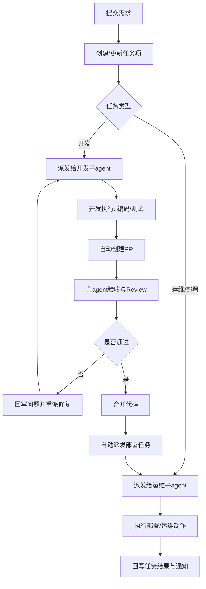

# 本地多 Agent 协作调度方案（通用蓝图）

> 把「提需求 → 开发实现 → 代码验收 → 部署上线」变成可追踪、可自动化、可规模化复制的协作流水线。
> 通用方法论，去业务化（不绑定具体任务平台与通知渠道），适用 luban 多 agent 协作场景。

## 1. 这套系统要解决什么问题

- **提任务更简单**：从低门槛入口（聊天/命令）发起任务，不需要先进入多个系统手工拆解。
- **执行更稳定**：任务自动派发给空闲执行 agent，减少「谁来做」「做到哪了」的沟通成本。
- **结果更可控**：每一步都有记录（任务项、PR、部署结果），便于追责、复盘和持续优化。

## 2. 一句话蓝图

以**任务系统**作为任务真相源、以**Git/PR**作为代码真相源、以**主 agent + 代理 agent + 本地执行 agent**作为执行网络，形成从需求到部署的闭环自动化系统。

> 任务系统可以是 GitHub Issues（luban 推荐 gh CLI）、Jira、飞书多维表格等，关键是「单一真相源」。

## 3. 设计原则

- **一个任务只有一个真相源**：任务状态只看任务系统，不看聊天记录。
- **一个代码结果只有一个真相源**：是否完成只看 PR/MR 与验收结果。
- **自动化优先，人工兜底**：系统自动执行，关键风险点（如强制合并）保留人工确认。
- **先可用再增强**：先用脚本能力跑通闭环，不上企业级新平台。
- **多 agent 协作但规则统一**：主 agent 和代理 agent 遵守同一派发协议。

## 4. 角色与职责

### 用户（需求方）
描述要做什么、希望何时完成、验收标准。

### 主 agent（主编排）
- 翻译业务目标为可执行任务包
- 派发、跟踪、验收、推动合并与部署

### 代理 agent（可选）
- 主 agent 不在线或需并行处理时承担编排
- 与主 agent 使用同一规则，不创建第二套体系

### 子 agent（执行者）
- 具体执行：开发、测试、运维、发布
- 仅在空闲时接新任务，避免并发冲突

## 5. 端到端流程

1. 用户提交需求（开发/运维/发布）。
2. 系统把需求转成任务项，补齐优先级、负责人、验收标准。
3. 主 agent 或代理 agent 按优先级派给空闲子 agent。
4. 子 agent 执行：
   - 开发类：实现代码 → 测试 → 自动提交 PR。
   - 运维类：执行运维动作 → 记录结果。
5. 主 agent 接收 PR，做 review 与验收。
6. 验收通过：自动合并代码 → 自动派发部署任务 → 部署结果回写任务系统并通知。
7. 验收不通过：自动回写问题 → 重新派发修复任务。

## 6. 流程图

## 7. 关键体验（对管理者最有价值）

- **看得见**：任何任务可追踪到「谁派发、谁执行、做到哪、是否上线」。
- **控得住**：主 agent 有统一验收口，避免「代码合了但没人验收」。
- **提得快**：低门槛入口降低发起门槛。
- **跑得稳**：执行 agent 按空闲规则接单，减少抢单和重复劳动。
- **可扩展**：后续可新增代理 agent 或更多执行机器，流程不需要重做。

## 8. 能力边界

- 当前「控制」是任务级控制（任务派发与状态流转），不是主机级控制。
- 不做 IP 绑定、设备硬绑定、远程进程强控。
- 以脚本化能力落地，不新增企业级常驻服务。

## 9. 典型场景

- **新需求开发**：业务提需求 → 自动拆解 → 自动开发/提 PR → 主 agent 验收 → 自动部署。
- **线上故障**：上报 → 自动生成应急任务 → 运维子 agent 排障/回滚 → 结果回写与通知。
- **例行运维**：定时巡检/证书更新/环境变更由主 agent 统一下发，执行结果沉淀为可复用模板。

## 10. 成功标准（产品验收）

- 发起任务到任务系统可见：≤ 1 分钟。
- 开发任务自动 PR 覆盖率：> 90%。
- PR 进入验收响应时间：≤ 5 分钟（工作时段）。
- 验收通过后部署任务自动派发成功率：> 95%。
- 任意任务可追溯完整链路：任务 → PR → 验收 → 合并 → 部署。

## 11. 版本建议

- **MVP**：先覆盖「开发任务 + PR 验收 + 部署派发」主链路。
- **增强**：补充事件触发、风险评分、失败自动重试、SOP 模板化。

## 12. luban 落地建议

- **任务系统**：GitHub Issues（`scripts/github/` + gh CLI），符合 luban GitHub 集成偏好。
- **通知渠道**：按团队约定（飞书/Slack/邮件）。
- **多 agent 拓扑**：luban AGENTS.md 要求「能开 subagent 就尽量并行」，本方案与之一致。
- **验收门禁**：复用 luban 的 E2E 执行契约（禁假绿/禁降级）作为自动验收标准。
